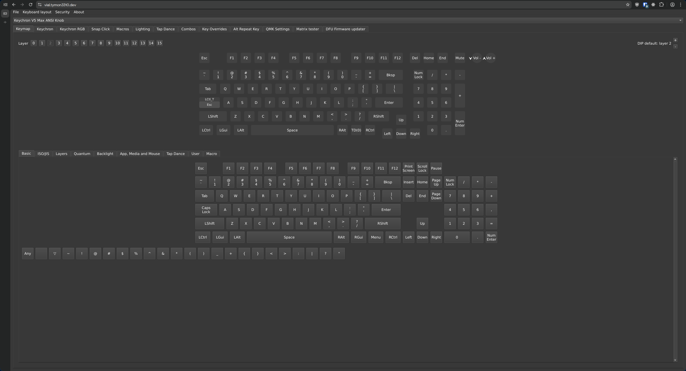

# vial-web (Keychron Edition)

Fork of [vial-kb/vial-web](https://github.com/vial-kb/vial-web) with Keychron keyboard support.

This is part of the [Keychron Vial ecosystem](https://github.com/tymon3310/keychron-vial) — see the central repo for an overview of all projects, supported keyboards, and documentation.

This fork compiles the [vial-gui (Keychron Edition)](https://github.com/tymon3310/vial-gui) to WebAssembly via Emscripten, enabling browser-based keyboard configuration through the WebHID API.

## Live Demo

Visit [leplatin.github.io](https://leplatin.github.io/vial-web/) to use this fork.

> **Requires a Chromium-based browser** — Google Chrome, Microsoft Edge, Brave, Opera, or Vivaldi. Firefox and Safari do not support the WebHID API and will not work.

## Features

Shares the same codebase as vial-gui, so all Keychron features are available:

- **Keychron Settings**: Debounce, NKRO, Report Rate, Wireless Low Power Mode
- **Snap Click (SOCD)**: Simultaneous Opposite Cardinal Direction configuration for non-HE keyboards
- **Keychron RGB**: Per-Key RGB, Mixed RGB modes, OS indicators
- **Analog Matrix**: Full Hall Effect keyboard support (profiles, actuation, rapid trigger, DKS, gamepad mode, calibration)

> **Note:** Some Keychron-specific features (particularly wireless/bridge functionality) may have limited support in the web version due to WebHID API constraints.

## Screenshot

The screenshot below shows the main keymap view with the extra tabs visible (Keychron, Keychron RGB, Snap Click, DFU Firmware updater):



## Building

```bash
git clone https://github.com/Tymon3310/vial-web.git
cd vial-web
git clone --branch vial-keychron https://github.com/tymon3310/vial-gui.git
git clone https://github.com/vial-kb/via-keymap-precompiled.git
./fetch-emsdk.sh
./fetch-deps.sh
./build-deps.sh
cd src
./build.sh
```

The output will be in `src/build/` — a static site ready to deploy.

## Deployment

The built files can be hosted on any static site hosting service:
- GitHub Pages (automatic via workflow)
- Cloudflare Pages
- Vercel
- Netlify

## Credits

- [vial-kb/vial-web](https://github.com/vial-kb/vial-web) - Original project
- [vial-kb/vial-gui](https://github.com/vial-kb/vial-gui) - Vial GUI
- [tymon3310/vial-gui](https://github.com/tymon3310/vial-gui) - Keychron Edition GUI additions

> **Note:** I only have a **V5 Max ANSI Encoder** for physical testing. If you encounter issues with any other keyboard, please [open an issue](https://github.com/tymon3310/vial-web/issues).
